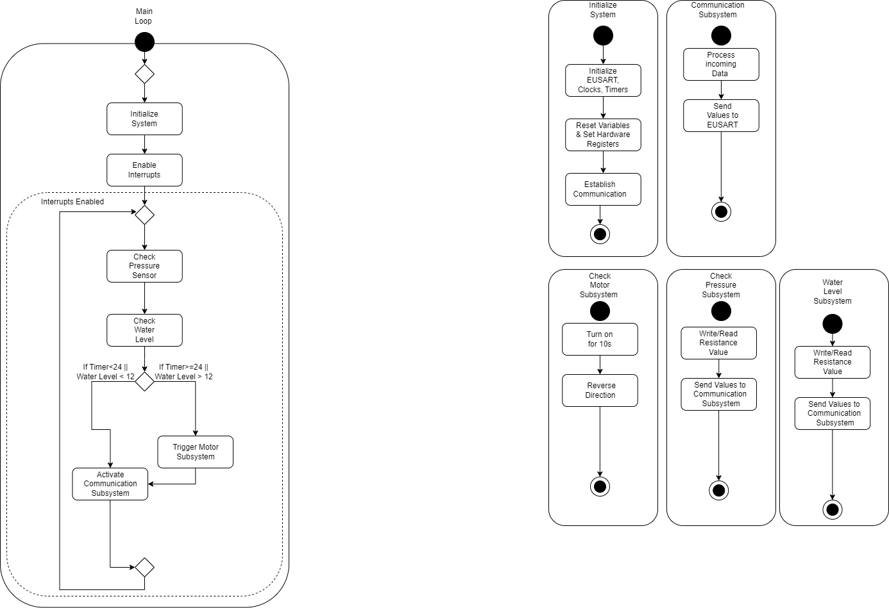



# EGR314 Fall 2023 : Team 302 Rain Gauge
---
Members:
Kalin Comins 
Marla Hawthorne 
Elton Salt 
Enyinnaya Onyenso
---
Prepared on 08/29/2023
Arizona State University 
EGR 314 Embeded Sys. Design Project II
---

[TOC]

## Introduction
We are a group of engineers who have been tasked with developing a mobile weather station. This station will be equipped with two serial sensors which can measure temperature, atmospheric pressure, wind speed,humidity, or other metrics upon approval and transmit the data via WiFi. Additionally, the station will include a motor which will enable us to remotely actuate an object of our choice according to the weather conditions. While this project will be challenging, it is also an opportunity to utilize our expertise to create a novel and cutting-edge product. We have the utmost confidence that we will be able to successfully execute this project and produce a mobile weather station which is both precise and dependable.

## Team Organization
<!-- Charter-->
Engineering projects are paramount to driving innovation adn progress in our world. It requires careful planning, excution, and coordination with a team to complete on time, on budget, and to the highest quality standards. This in the forefront of our minds led us to create our charter as follows:
"The project's goal is to develop a hands-free gadget that is straightforward to use and maintain, uses ecologically friendly designs and materials to produce a product, and may be expanded upon in the future for an end product. Along with creating a project we can add to our resumes for potential employers, the project team hopes to promote a positive work environment that encourages collaboration." This gives our team a solid foundation we can build on to create a productive and well organized collaborative team.
<!-- Mission Statement-->
With our charter firmly in place for our team, we then turned to create our mission statement for this specific project. We know that weather stations are essential for collecting and monitoring weather data. They are used to make weather forecasts, track climate change, and provide early warning of severe weather events. Mobile weather stations are a new type of weather station that are becoming increasingly popular. Mobile weather stations are portable and can be used anywhere, making them ideal for collecting data in remote areas or areas devoid of access to traditional weather stations. Taking this information into consideration we devised a mission statement that we believe perfectly encapsulates this project and its as follows:
"We believe that all people deserve access to reliable, easy-to-use, and comprehensible weather information. The goal of our product is to make that a reality for people who don’t necessarily occupy one place. We use the most up-to-date technology to give our users the best experience possible. We use the latest sensors, actuators, and are always innovating to make our product better. We are passionate about making a positive impact on the world around us. We believe our product can keep people safe and make decisions about their lives while they are on the go." With our charter and mission statement created, we could then move onto the more tangible parts of the project, starting with our user needs, benchmarking, and product requirements and if you want to know more about our team organization please refer to the appendix.

## User Needs, Benchmarking, and Requirements
We identified our user needs by conducting research on products that are on the market. By combing through the pages of reveiws, five stars to one star, we were able to distill what the user was looking for in a mobile weather station. Our team specifically picked out smart rain gauges as a market to pursue and from what we gathered, the user needs were apparent. By going through the reviews of certain popular and unpopular smart rain gauges, we identified sore spots or highlights the consumer contiuously pointed out in their reviews. We took these pain points and praises, seperated out the fluff and kept what was relevent to us, dividing this data up into two categories, Latent and Explicit. Explicit being more easily identifiable pain points and Latent being points that are more difficult to pin down as to why they're frustrating. We then took these points of frustration and pain and turned them into specifcations from where our product can draw its strengths from.To ensure these specifications our design will revolve around we will constantly be reffering to our list of product requirements to make sure we incorporate at least the top twenty five percent of them in our product. Our product requirements list is our most purest form of user needs that relate specifically to our device and with this list we can asses our device according to it. Some standout requirements we were not anticipating were the device can withstand extreme heat and cold temperatures, the device is made from rugged material, and even more surprisingly, the device has the ability to save the user money. For the full list of product requirements and user needs they can be found in the appendix.

## Design Ideation
Kalin Comins played the key role in the design process, his intial design concept is what sparked a host of different design ideas and iterations. Elton Salt's role was the refinement of the actuation system in Kalin Comins design concept. Enyinnaya Onyenso's role was how the device is going to be manufactured and constructed using only surface mounted components. Marla Hawthorne's role was how the concept was going to coalesce into a finsished a finished project that met or exceeded the guidelines we were given.
 We used a couple of different brainstorming methods, mind mapping, figure storming, rapid ideation, but the method that worked best for us was round robin. Everyone was able to pitch their ideas and we voted on which would be the most viable for our group and the projects scope. We then took these ideas and ranked them with a 3 star sytsem, 1 being the least viable and 3 being the most viable. Then we all created a concept of our device around the ideas we ranked so we can have the most variety and originality as possible in our device. The concepts can be found in the appendix.

 ## Selected Design 
The design we decided to pursue was the rain guage and we chose that design for a number of reasons. The first being is simplicity, the aim of our group is to produce a product that adheres as closely to the product requirements and and user needs as possible. The simplicity in the rain gauge's design allows us to do just that and create an actual, functioning product. The second reason we chose the rain guage is because it is the culmination of all our ideas into one simple package with little being left out of our design. The final reason we chose we the rain gauge is because of the possibility of expanding the devices use cases. We wanted to create an uncomplicated device with the potential to expand its capacities. The rain guage design gives us that flexibility without sacrificing our main intent of creating a manageable device. The current design of the rain guage can be seen below in **Figure 1.**

**Figure 1.** Rain Guage Concept

## Block Diagram 
From the design we currently have, we created a block diagram to flesh out how the rain guage will actually work and how the subsytems will function as seen below in **Figure 2.** By using a block diagram we can map out how the device will come together and conceptualize what the final design will function like. We can also put the user needs and product requirements into action, as you can see from the diagram; the barebones of the block diagram allow us to fit the user needs and product requirements into our design with tangible parts, system requirements, and data connections. From the block diagram we then could start our component selection and begin picking components for our design

**Figure2.** Rain Guage Block Diagram

## Component Selection
The component selection can be arguably the most important segment of our project, this section directly impacts the product and the project as a whole. In order to establish the component selection section of the product, we first reestablished ourselves with the product's specific requirements. Specifically, what are the user needs and product requirements that the product needs to satisfy? Additionally, what size, weight and power constraints must be met in order to meet the product's requirements? From there, we began researching various components that may be applicable to the product. When selecting components, we had to consider a number of factors, such as: performance: components must meet the product's performance requirements. Cost: components must be cost-effective and not exceed the project's budget. Availability: components must be easily accessible and not difficult to obtain. Reliability: components must be dependable and not cause product failures or customer dissatisfaction.Once we had considered all of these factors, we selected a set of components that we believe best meet the needs of the product. Next we needed to power these components, so we created a power budget to see what our power needs were and what solution would best fit to satisfy those needs. The sensors are pull little to no current, however the microcontroller and the motor can require a lot of current. The amount of current needed to power these components reliably led us to decide going with 120V AC wall powersupply that's then stepped down to 12V DC power. Using the wall power supply is more feasible for this project at this stage of development. Battery operation would add more complexities and could potentially compromise our goals of fulfilling our product requirements and user needs.To see the components we selected and the full power budget we created refer to the appendix for the more details. 

## Hardware Proposal
Our current electrical schematic can be seen below in **Figure 3.**, these are how our components from the component selection will look and function in a circuit. We seperated the subsystems for easier viewing of them and to gain a better understanding of how they will all fit into the makeup of the device. The boards design comes directly from the product requirements and user needs, and follows our projects overall theme of simplicity. We wanted to minimize complex wire routing and schematic layouts to reduce instances of shorts, open circuits, and unconnected components. A reduction of those instances precisely leads to a more reliable device, a device that is easy to troubleshoot, and a device that can last a long time, to name a few of our product requirements and user needs this design directly addresses. Creating this electrical schematic using the components we selected led to issues of shared data lines and incompatible power requirements, rectifying these issues without creating a more complex and involved was challenging, but we succeeded in doing so. 

**Figure3. Team Board Electrical Schematic**

## Software Proposal
With our components selected and them mapped out in an electrical schematic, we needed a way to draft what our software would run like on the harware we selected. For this we created a diagram using unified modeling language or UML, a UML diagram is a way visualize our design, subystems, and software we intend to program to our hardware. Our UML diagram can be seen below in **Figure 4.**, and as you can see it is fairly simple. This is by design of course, our diagram aligns with our project wide theme of simplicity, which also produces simpler debugging and programming as an unintended byproduct. Like our physical subsystems, our software is also segmented into subsystems, this makes it easier for us to debug if issues arise in programming and allows us to customize them based on the parameters we set without changing the entire structure of the program. With the software segmented in subsystems we can also call them whenever we like to modify or completely change how our device functions. The subsytems of our software are also directly in line with our product requirements and user needs, some of those being the incorporation of wireless connectivty, automated systems, and support for an expanded ecosystem in the future.

**Figure 4. UML SystemmSoftware Diagram**

## Appendix

## Team organization
Team 302
 *Team Goals*
Create a hands-free device that is simple to use and easy to maintain.
Employ the use of sustainable designs and materials to deliver an environmentally cohesive product. 
Make something we can at least build off of in the future for a cohesive project
Create a project that we can add to our portfolio for future employment
Foster a favorable work environment to foster building connections

*Charter*
The project's goal is to develop a hands-free gadget that is straightforward to use and maintain, uses ecologically friendly designs and materials to produce a product, and may be expanded upon in the future for an end product. Along with creating a project we can add to our resumes for potential employers, the project team hopes to promote a positive work environment that encourages collaboration.

*Mission Statement*
We believe that all people deserve access to reliable, easy-to-use, and comprehensible weather information. The goal of our product is to make that a reality for people who don’t necessarily occupy one place. We use the most up-to-date technology to give our users the best experience possible. We use the latest sensors, actuators, and are always innovating to make our product better. We are passionate about making a positive impact on the world around us. We believe our product can keep people safe and make decisions about their lives while they are on the go.

*Communication Channels*
Name
1st Choice Comm.
2nd Choice Comm.
3rd Choice Comm.
 Marla Hawthorne
1.Discord
2.Canvas
3.Email
 Elton Salt
1.Discord
2.Email
3.Cellphone
 Kalin Comins
1.Discord 
2.Email
3.Canvas
 Enyinnaya Onyenso
1.Discord
2.Email
3.Canvas

*Communication Procedures*
All communication will first take place on Discord. Discord will be our primary source of information, where information from instruction or other sources will be placed by whomever receives it first. This will allow everyone in your group to stay connected to the most up-to-date information available. All members will use Discord to communicate and discuss any instructor correspondence in order to progress with our project.
Meeting Schedule

*Meeting Coordination*
We will use a discord reminder tool to keep track of meetings. 
Our team will adjust or add meeting dates as needed via discord meetings and notifications. 
The preferred meeting format is virtual, but meetings can also take place in person.
Our team doesn't feel there are any other procedures necessary at this time, if need be, we can revise this document to add any additional procedures we agree are necessary. 

*Roles and Responsibilities*
1.Role
2.Duties
3.Assignment
1.Secretary
2.Coordinates meetings as necessary
3.Marla Hawthorne
Lead Planner
Makes notes on next steps 

Elton Salt
1.Assignment Leader 
2.Keeps time of due dates 
3.Starts documents
Kalin Comins
1.Project Manager
2.Manages changes in the evolving project
Enyinnaya Onyenso

Project roles can change after each checkpoint.
Each role is decided by volunteering, and if needed, the group will assign.
By directly or indirectly aiding those who need it we can help one another meet their responsibilities.
We will see who needs the most help and adjust the roles so those who may be doing less can help those who may be doing more.
Team activities and milestones will be tracked using the assignments and checkpoints as larger beacons of progress, while internal milestones and goals will be checked through our communication routes.
We will assign technical responsibilities by who has the most experience, if experience is equal then paired learning can be incorporated in our assignment.

*Team Coordination & Accountability*
Each assignment will be subject to a review process after completion. If someone objects to the submission of an assignment, the objection is reviewed and/or the assignment is amended/submitted depending on how the review goes. Everyone will have the opportunity to comment on the assignment. If they would like, they may waive their chance to comment at their own discretion. 
The skill or knowledge confirmation will be verbal. In the event of an absence, we will rearrange the duties in an appropriate manner to ensure everyone carries a reasonable workload. 
Feedback will be discussed in a virtual or face-to-face meeting. After such a meeting, feedback will be divided and processed by each member on the team based on their role in providing the feedback. If no role was provided, then the member or members not involved will help those who were.
To address missed contributions/assignments/actions, a three strikes rule will be implemented. This means that everyone gets three chances(strikes) to make a mistake, after the final chance(strike) a major group meeting will take place with the instructor and possibly result in the offending member receiving a pink slip(out).
Addressing missed assignments/contributions/actions will take place either in person or virtual in our discord.
We will hold each other accountable using the three strike rule I mentioned above.
If an underperforming team member is not putting in the same amount of effort or quality of work as the other members, this will be immediately flagged by the feedback and score we get from the instructor.
We will help the underperforming member by directly getting involved and bolstering their understanding, performance, and output.
The consequences of an underperforming member will fall under the three strikes rule laid out above.

*Conflict Recognition & Resolution*
All conflicts will be solved in the discord. No deleting of messages will be tolerated. Any major conflicts will be brought to a person with more experience for a second opinion. Any minor issues will be settled with a dice roll.
Major conflicts include:
Component Selection
Major individual time allots 
Major Project Decisions
Project requirements

Minor conflicts include:
Role/ work assignments
Total effort output
Quality of work 
Meeting times 

Signatures
X Elton Salt
X Marla Hawthorne
X Enyinnaya Onyenso
X Kalin Comins

## Ordered User Needs and Benchmarking:
The device has automated systems  
The device makes accurate measurements  
The device includes wireless connectivity  
The device is made from rugged material  
The device is reliable  
The device is easy to set up  
The device is a time saver  
The device has the ability to save the user money  
The device takes consistent measurements  
The device has an attractive design  
The drive can be manufactured in multiple colors and finishes   
The device is designed for longevity  
The device can be portable  
The device is calibrated from the factory  
The device can be calibrated by the user  
The device uses renewable energy for its power consumption  
The device is designed with an expandable ecosystem in mind  
The device is efficient with its power use  
The device has easy to read measurements  
The device caters to a large demographic  
The device incorporates an inoffensive design  
The device can be mounted to existing hardware  
The device can store data in the cloud  
The device can store data on local storage solutions  
The device can measure multiple points of weather data  
The device provides a strong wireless connection  
The device can measure wide intervals of data  
The device can withstand high speed winds  
The device can withstand prolonged exposure to UV rays without discoloration  
The device can withstand extreme heat and cold temperatures  
The device allows the user to be self-sufficient/independent  
The device’s screen can be viewed from multiple angles  
The device’s display is backlit  
The device’s display has touch capacity  
The device can self-diagnose for problems  
The deuce can empty its data collection tube autonomously  
The device has a standby mode  
The device has intuitive software  
The device can be serviced by the user  
The device will include enough accessories for use out the box  
The device can be used by multiple users  
The device will come with a troubleshooting guide  
The device can be engaged with remotely  
The device will come with a user friendly manual  
The device’s battery life will be substantial  
The device will be as small as comfortably possible  
The device will feature physical hardware buttons  
The device can be operated completely remotely  
The device will maintain a quiet noise profile  
The device can perform simple statistical analysis of data collected  
The device can provide multiple measurements  
The device will be environmentally cohesive  
The device will offer a subscription program  
The device will support offline operation  
The device will offer smart home integration  
The device will offer emergency warnings  
The device can provided verbal alerts  
The device can offer auditory notifications  
The device can withstand shock  
The device can withstand salt fog  

## Aspects
1. 	**Product Design**  
The product design will be based on current market options and include improvements on them such as:  
1.1   The product shall be made of weather resistant material.  
1.2   The product shall include necessary hardware for accessory access.  
1.3   The product shall incorporate an inoffensive design.  
1.4   The product shall include all necessary accessories color matched to the main unit.  
1.5   The product shall have an easy to access power port.  
1.6   The product shall be as small as comfortably  possible.   
1.7   The product shall include a large backlit display.  

2   	**Functionality**  
2.1   The product shall incorporate all necessary radios for wireless communication.  
2.2   The product shall offer a large data collection container.  
2.3   The product shall incorporate an atmospheric sensor to determine barometric pressure.  
2.4   The product shall have a month(s) long battery life.  
2.5   The product shall use a resistive or ultrasonic sensor for rainfall measurements.  

3   	**Interactivity**  
3.1   The product shall function and pair to the outside device and the user’s device.  
3.2   The product shall offer data emptying functions including data collector emptying via remote motor actuation.  
3.3   The product shall offer an interactive touchscreen displaying data.  
3.4   The product shall offer a standby mode that displays ambient weather information.  
3.5   The user interface shall be intuitive for all users after reading the manual.  
3.6   The product's functions and data shall be accessible from a web application.  

4   	**Adaptive Intelligence**  
4.1   The product shall provide real-time automatic weather updates to the user.  
4.2   The product shall perform automatic sensor calibration.  
4.3   The product shall automatically empty its data collection container once full and after the data has been logged.  
4.4   The system shall enter standby mode once direct interaction has been finished.  

5   	**Customization**  
5.1   The product shall offer multiple means of weather data collection.  
5.2   The product shall offer multiple purchasable display packages.  
5.3   The product shall be user configurable with purchasable add-on sensors.  
5.4   The product shall be offered in different finishes and colors depending on the material selected for production.  

6   	**Manufacturing**  
6.1   The total FOB cost price of the product shall be <$125.  
6.2   Parts must be mass-producible in batches of 10,000 parts.  
6.3   The product shall be designed to assemble in under 2 minutes.  
6.4   The position of any component cannot change during assembly.  
6.5   Functioning of the device shall be easy to check by the manufacturer.  
6.6   The product shall be designed to consist of the minimum possible amount of parts.  
6.7   The product shall be calibrated during manufacturing.  
6.8	The product shall be constructed to be user serviceable.  

7   	**Regulations**  
7.1    The product shall pass a standard ASTM D 1148 test for discoloration from UV light and heat.  
7.2 The product shall pass a standard MIL-STD-810 humidity test.  
7.3 The product shall pass MIL-STD-810 Methods 501, 502, and 503 tests for extreme temperatures.  
7.4 The product shall pass a standard ASTM B117 test for salt fog conditions.  

**Benchmarking**
Search #1
Product #1
Keywords: Weather Station
Search Result link: https://www.amazon.com/s?k=weather+station&crid=1JA01T724WXJJ

Price: $449.99
Vendor:Amazon
Description: WS-5000 Smart Weather Station, Solar powered and features a Barometer and Hygrometer with optional additions.

Positive
The reviewer needed a reliable replacement for another weather station. The reviewer likes that the device is easy to set up. The reviewer also likes that the device can be placed to avoid obstacles. The reviewer likes that the display is intuitive and setting up data transfer is easy.
The device is easy to set up. (Explicit)
The device is accurate. (Explicit)
The device is portable (Explicit)
The device stores data for easy access (Latent)
The reviewer replaced their functional but outdated Davis Weather Monitor II with the Ambient WS-5000 weather station; they experienced no issues after 4 days of use. Setting up the station involved entering latitude/longitude for sunrise/sunset, configuring Wi-Fi, creating an Ambient Weather account, and inputting the MAC address. The station offered accurate data with detailed graphs, while the console's display was bright initially but was adjusted to dim at night. The cost-effective unit provided improved features over the old Davis model, breaking down rainfall data and avoiding data upload charges.

The device input is customizable. (Explicit)
The device is cost effective (Explicit)
The device represent data in a detailed and orderly manner (Explicit)

The reviewer bought the Ambient WS-5000 weather station 1.5 years ago, impressed by its high quality compared to their previous weather devices. They appreciated the accuracy of the rain gauge, although it requires occasional cleaning due to debris. They use rechargeable Lithium batteries for extended battery life. The customer found the mobile app useful for remote weather monitoring and mentioned the option to join a large weather network. They advised careful placement of the station due to potential impact on wind and rain readings, and overall, they expressed satisfaction with their purchase decision based on their research.
The device has a long battery life (Explicit)
The device can be easily customized with new parts/sensors (Explicit)
The device requires occasional cleaning (Explicit)

Negative
The reviewer thinks the overall unit is a good unit. They believe it is expensive and cheaply made. The screen is far too small to see most of the information from more than a few feet away. Also the screen breaks with a minor drop (18 inches for me). Out over two hundred dollars to replace.
The device should be made with durable materials (Explicit)
The device should have ample display capabilities (Explicit)
The device should have lower replacement cost (Latent)
The customer expresses significant disappointment with their recent purchase of the WS5000 weather station. They found the assembly process to be challenging and not as straightforward as indicated in the video guide. They regret not choosing the $300 unit that permits mounting all components on a single pole for better quality and simplicity. Compared to their previous Davis station's 10-year lifespan, they express further concern as the sensor hangs below the hydrometer, indicating potential issues with design and durability.
The device should be easy to assemble (Explicit) 
The device should be safe to use (Explicit) 
The reviewer's initial enthusiasm for the WS5000 weather station faded when they switched to Starlink internet and the station failed to connect. Despite seeking help from Ambient tech support, they were informed that the station doesn't support Starlink or 5G and the company appeared indifferent to this limitation. The inability to access data online or remotely monitor their RV's temperature due to the lack of internet connectivity disappointed the customer. They also criticize the station's setup process and outdated menu system, concluding that while the station itself is good, the poor setup experience and lack of support for emerging technologies like Starlink and 5G make it a less attractive option, especially for those who value internet connectivity.
The device should have good network connectivity (Latent)
The device should have an intuitive user interface (Explicit)

Search #2
Product #2
Keywords: Rain Gauge
Search Result link: Link
Selected Product: AcuRite Wireless Digital Rain Gauge with Self-Emptying Collector with Rainfall History, Alerts, and Current Date and Time (00899), Multicolor

Price: $37.76
Vendor:Amazon
Description: The AcuRite Digital Rain Gauge with Self-Emptying Wireless Rain Collector features precise, reliable rainfall measurements. The LCD screen displays daily rainfall and records rainfall history, including a rainfall event, 1 day or 7 days of measurements. Includes rain and flood watch alarms. The outdoor sensor is self-emptying and transmits rain data wirelessly. Includes a clock and calendar. Display stands upright for tabletop use or is wall-mountable. 

Positive
The reviewer is very satisfied with the rain gauge and believes it is better than any other they have used before. They love that it is self-emptying, which saves them time and hassle.They also appreciate that it stores 7 days of data, which allows them to track rainfall patterns over time.The reviewer says that the rain gauge has helped them save money on watering their lawn.They also mention that the rain gauge was easy to set up.
The device is a time saver. (Latent)
The device is easy to set up. (Explicit)
The device saves the user money. (Explicit)
The reviewer is very happy with the rain gauge and loves that it empties itself, tracks daily rain amount, and stores history of rain amount. They also appreciate the accuracy of the rain gauge and find it fun to see the totals adding up each time it rains.
The device can empty itself.(Explicit)
The device provides accurate measurements. (Explicit)
The device is engaging to its user. (Latent)
The reviewer is very happy with the AcuRite Wireless Digital Rain Gauge and finds it to be accurate. They have compared the readings from the rain gauge to the readings from their weather station and found that they are within 1/100th to no more/less than 1/10th of each other. The reviewer likes that the rain gauge allows them to know how much rain they have received, rather than relying on regional totals from the news. They have found that the rain gauge is especially helpful in areas where rainfall can vary greatly from place to place.
The device provides accurate measurements. (Explicit)
The device allows the user to be more independent. (Latent)
The device provides consistent measurements. (Explicit) 

Negative
The reviewer purchased a rain gauge and set it up according to the manual. However, the rain gauge did not measure the rainfall correctly. The reviewer used a manual rain gauge to measure the rainfall and it showed that 2.5 inches of rain had fallen. However, the digital rain gauge only registered less than 0.05 inches of rain.
The device provides accurate measurements. (Explicit)
The device’s manual needs to be user friendly. (Latent)
The device is easy to set up. (Explicit)
The reviewer purchased a wireless rain gauge and has been using it for about a month. However, the rain gauge has lost signal multiple times. The reviewer has placed the receiver in the window closest to the collector, which is about 20 feet away. Even with the receiver closer to the collector, the rain gauge still loses signal.
The device needs to have a strong wireless connection. (Explicit)
The device needs to be more reliable. (Latent)
The device’s accessories need to be as robust as the main device. (Latent)
The pairing process was difficult and took several tries. If the batteries are bumped, the system resets and has to be set up again. The readings from the rain gauge are inaccurate.
The device is easy to set up. (Explicit)
The device needs to be rugged enough for extended outdoor use. (Latent)
The device's software needs to be intuitive/stress-free. (Latent)

Product #3
Search Result link: Link
Selected Product:Logia 7-in-1 Weather Station Indoor/Outdoor Weather Monitoring System, Temperature Humidity Wind Speed/Direction Rain UV & More, Wireless Color Console w/Forecast Data, Alarm, Alerts

Price: $99.99
Vendor:Amazon
Description:This unit tracks indoor/outdoor humidity and temperature; wind speed and direction; current rainfall and rate; UV and solar intensity and a host of other weather-related details. 

Positive
The reviewer purchased a wireless weather station and is generally happy with it. The display is nicely made, but it is too small for the reviewer's desired location. The weather station is supposed to receive a time signal, but it has never happened. The reviewer had to set the clock manually. The weather station is accurate and the outside piece is compact.
The device needs to have an easy to read display. (Explicit)
The device's software needs to be intuitive/stress-free. (Latent)
The device's physical appearance should be inoffensive. (Latent)
The reviewer purchased a wireless weather station and is using it to monitor the weather conditions outside their home. They had no trouble connecting the station with the base unit and there have been no connectivity issues with a 50-60 foot separation. The reviewer believes the weather station to be accurate and responsive to changing conditions.
The device needs to have a strong wireless connection. (Explicit)
The device provides multiple measurements of weather conditions. (Explicit)
The device provides accurate measurements. (Explicit)
“It is brilliant I'm a 12 year old boy who wants to become a meteorologist and this is the perfect gift thank you”
The device can be used by a large demographic. (Latent)
The device's software needs to be intuitive/stress-free. (Latent)
The device is easy to set up. (Explicit)

Negative
The reviewer purchased a wireless weather station and is not happy with it. The weather station is constantly losing signal and it is not easy to get it to pair up again. The outdoor unit also shows half battery after only a few weeks, even with Duracell batteries. The reviewer does not recommend buying this weather station as it is not reliable.
The device needs to have a strong wireless connection. (Explicit)
The device needs to be efficient. (Explicit)
The device is easy to set up. (Explicit)
The reviewer purchased a weather station and it worked as intended for the first 35 days. However, after 35 days, the weather station stopped working. The reviewer tried to reset the unit but the reset light would not come on. The reviewer checked the batteries and they were good, and they even replaced the batteries but the weather station still did not work. The reviewer would not recommend this product.
The device needs to be rugged enough for extended outdoor use. (Latent)
The device's software needs to be intuitive/stress-free. (Latent)
The device needs a complementary troubleshoot guide. (Explicit)
The reviewer ordered a weather station and the display would flicker. They returned it for a new one but the display was worse. The reviewer could not see the display at all and they returned it.
The device needs an easy to read display. (Explicit)
The device needs to be rugged enough for extended outdoor use. (Latent)
The device needs a complementary troubleshoot guide. (Explicit)

Product #4
Keywords: Weather Station
Search Result link: Link

Price: 339.00
Vendor:Amazon
Description: Tempest Weather System with Built-in Wind Meter, Rain Gauge, and Accurate Weather Forecasts, Wireless, App and Alexa Enabled

Positive
The reviewer was impressed with the product and researched many other products before choosing this product. The product withstand temperatures over 110 degrees and works with no problems. The accuracy of the forecast is more accurate than the National Weather Service for local weather.
Need hardware for mounting the product.
Need to come in different colors to match the environment. 
Reviewer had a problem with the Tempest when a humidity sensor was faulty. Tech support was very helpful and sent a replacement within 3 days. Even with the faulty product reviewer still recommends product and values tech support. 
Need a way to run self-diagnostics to find problems.
Need to be tested before leaving the factory.
Reviewer was impressed with the ease of setup and it was hard to mess up. Reviewer was skeptical of the forecast till it was proven true. Lastly the rain accuracy was spot on compared to the last unit(different brand) owned. 
Need rain and wind direction sensor. 
Need to last a few years. 

Negative
Reviewer had trouble with the unit, data was random and off in measuring. Tired calling tech support but got no answer and could not get the unit working right. Wrote an app to display temperature and sensor was off by 3 degrees. 
Need better tech support for answers and solutions. 
Need sensors to work properly.
Reviewer had it in operation for 18 months but it was unreliable. The accumulative rain was the first problem, it would read randomly. The wind speed feature was the next problem. 
Need accumulation of rain to work.
Need a unit to read wind speed accurately. 
Reviewer said the product was extremely inaccurate. The wind speed was wrong and direction was wrong also. The rain sensor would read outside with no rain. The only slightly right was the temperature sensor but still a few degrees off.  
Need sensors to work properly. 
Need a year warranty. 

Product #5
Keywords: Rain gauge
Search Result link: Link
Price: 119.19
Vendor: Ambient Weather
Description:
 
Positive
The unit works impressively as expected. I’m still learning its capabilities & limitations. For example, I’m wondering how long the wind gust data are retain: 1 min., an hr, …? Peak gust speed in the 24 hrs?
Show different statistics (Latent)
Have a lot of options (Explicit)
Works! Not too difficult to install. Colors on the monitor are a bit much. Dark background with white numbers would have been fine for me.Would like more options for temp min and max. Ex min & max for 24 hours, a week, a month, a year.
Have a large temperature range (Explicit)
Work on power for a week (Latent)

Negative
I found the backlight in the indoor display could be brighter.
Bright backlight (Explicit)
Light around screen (Latent)
If you are not looking almost straight on to it, the information disappears from view until you move back on-axis. This is a common problem for this type of screen, but it's still unfortunate. 
Screen visible from multiple directions (Explicit)
Easy to use screen type (Explicit)
I only wish it didn’t need to be plugged in for the display to stay on. Pretty hard to find the button in the dark. I’d rather change batteries with it staying on than having the cord running down to a plug.
Battery powered (Explicit)
Light up controls (Latent)

## Design Ideation

**Benchmark Ranking**

3 star to the right, 2 star in the middle, 1 star to the left.

**Concepts**
Rain Gauge Concept

Wind Turbine Concept

Hygrometer Concept

## Component Selection Full List

## Power Budget 

