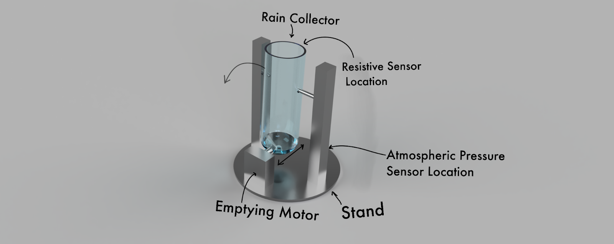
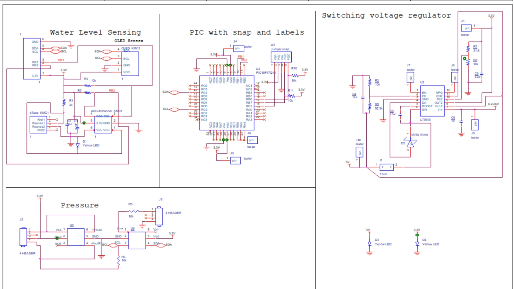
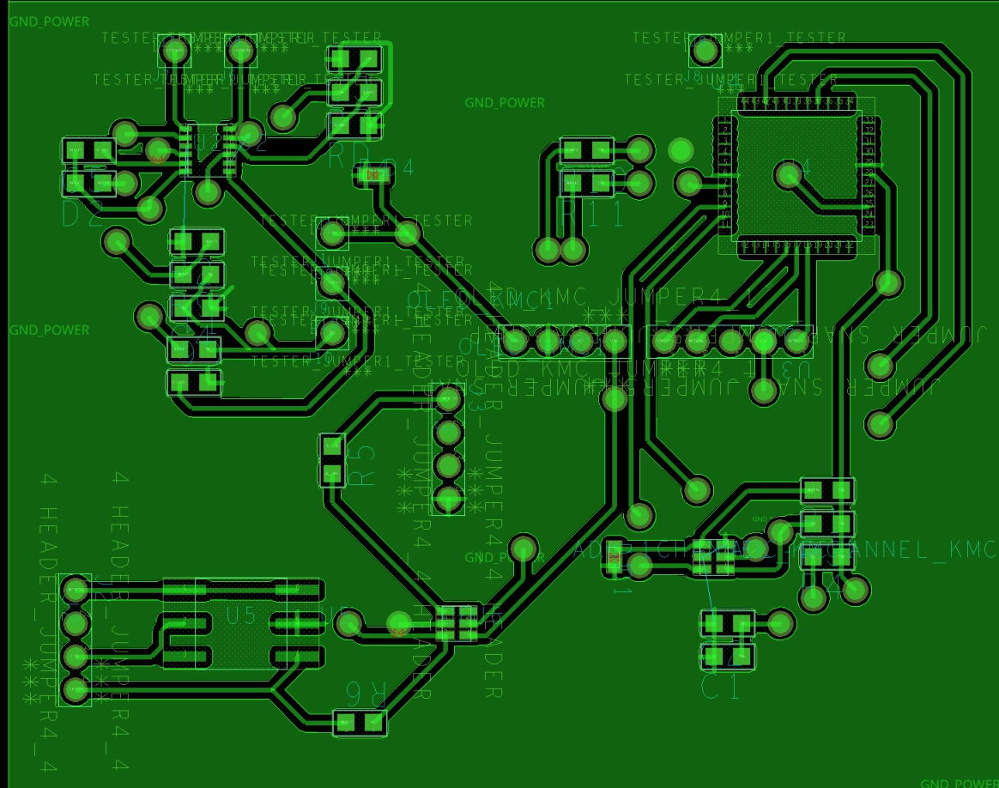
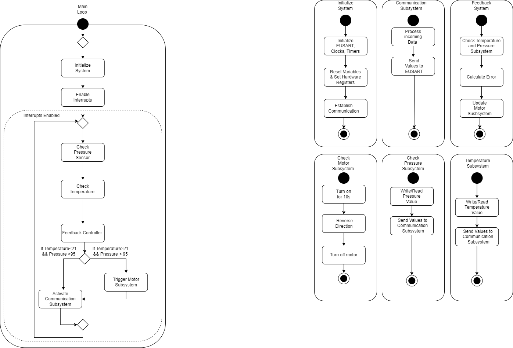
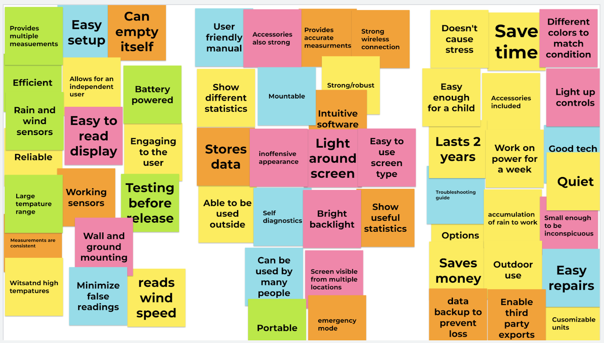
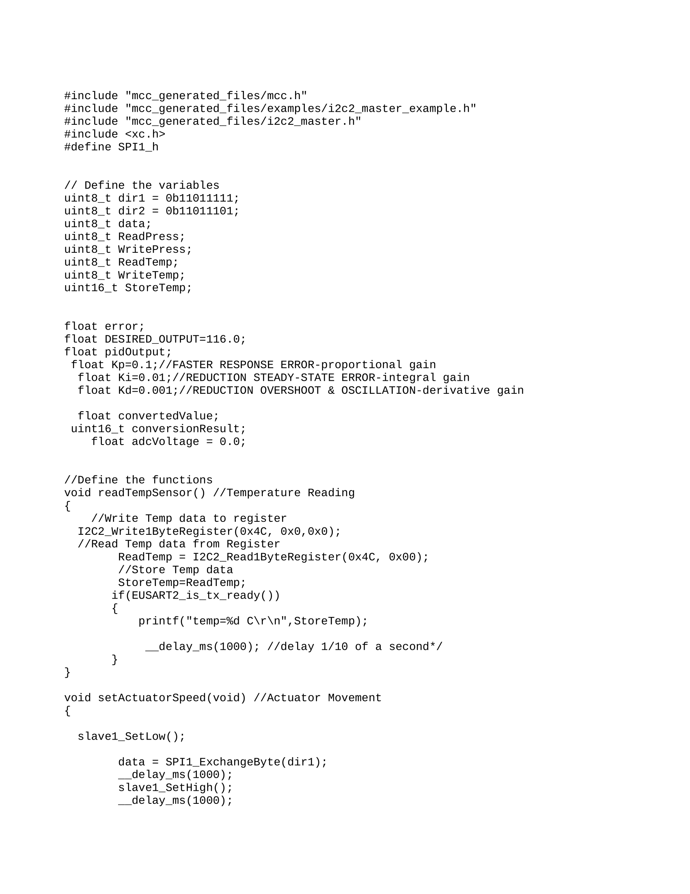
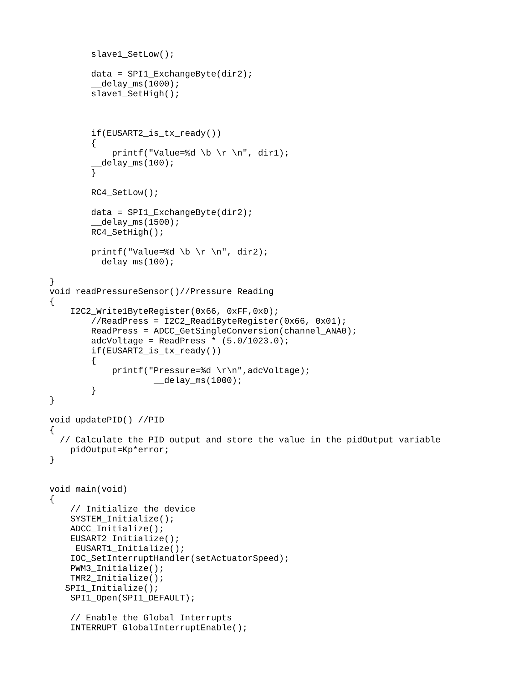
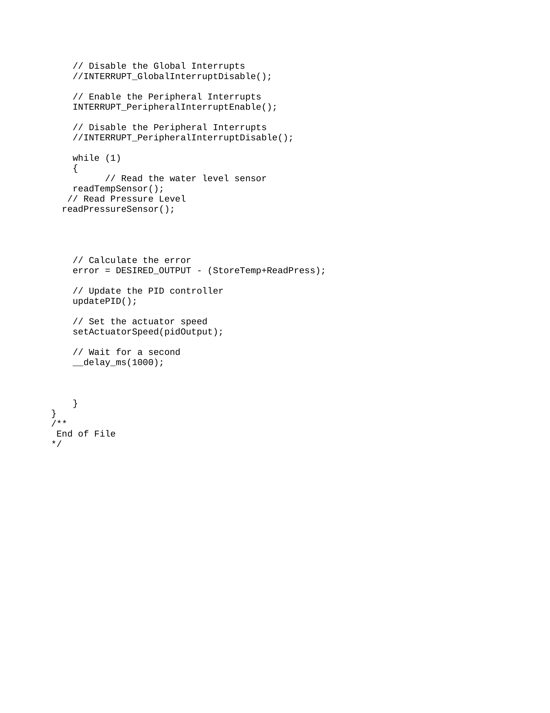

# EGR314 Fall 2023 : Team 302 Rain Gauge
---
Members:
Kalin Comins 
Marla Hawthorne 
Elton Salt 
Enyinnaya Onyenso
---
Prepared on 08/29/2023
Arizona State University 
EGR 314 Embedded Sys. Design Project II
---

- [Introduction](#introduction)
- [Team Organization](#team-organization)
- [User Needs, Benchmarking, and Requirements](#user-needs--benchmarking--and-requirements)
- [Design Ideation](#design-ideation)
- [Final Selected Design](#final-selected-design)
- [Block Diagram](#block-diagram)
- [Component Selection](#component-selection)
- [Final Hardware](#final-hardware)
- [Final Software](#final-software)
- [System Verification](#system-verification)
- [Lessons Learned](#lessons-learned)
- [Recommendations for Future Students](#recommendations-for-future-students)
- [Appendix](#appendix)
  * [Team organization](#team-organization)
  * [Ordered User Needs and Benchmarking:](#ordered-user-needs-and-benchmarking-)
  * [Aspects](#aspects)
  * [Design Ideation](#design-ideation-1)
  * [Component Selection Full List](#component-selection-full-list)
  * [Power Budget](#power-budget)
  * [BOM](#bom)
  * [Closer Look at Temperature Sensor](#closer-look-at-temperature-sensor)
  * [MQTT Topic Table](#mqtt-topic-table)
  * [Rain Gauge Code & Resources](#rain-gauge-code---resources)

<small><i><a href='http://ecotrust-canada.github.io/markdown-toc/'>Table of contents generated with markdown-toc</a></i></small>

## Introduction
We are a group of engineers who have been tasked with developing a mobile weather station. This station will be equipped with two serial sensors which can measure temperature, atmospheric pressure, wind speed, humidity, or other metrics upon approval and transmit the data via Wi-Fi. Additionally, the station will include a motor which will enable us to remotely actuate an object of our choice according to the weather conditions. While this project will be challenging, it is also an opportunity to utilize our expertise to create a novel and cutting-edge product. We have the utmost confidence that we will be able to successfully execute this project and produce a mobile weather station which is both precise and dependable.

## Team Organization
<!-- Charter-->
Engineering projects are paramount to driving innovation adn progress in our world. It requires careful planning, excution, and coordination with a team to complete on time, on budget, and to the highest quality standards. This in the forefront of our minds led us to create our charter as follows:
"The project's goal is to develop a hands-free gadget that is straightforward to use and maintain, uses ecologically friendly designs and materials to produce a product, and may be expanded upon in the future for an end product. Along with creating a project we can add to our resumes for potential employers, the project team hopes to promote a positive work environment that encourages collaboration." This gives our team a solid foundation we can build on to create a productive and well organized collaborative team.
<!-- Mission Statement-->
With our charter firmly in place for our team, we then turned to create our mission statement for this specific project. We know that weather stations are essential for collecting and monitoring weather data. They are used to make weather forecasts, track climate change, and provide early warning of severe weather events. Mobile weather stations are a new type of weather station that are becoming increasingly popular. Mobile weather stations are portable and can be used anywhere, making them ideal for collecting data in remote areas or areas devoid of access to traditional weather stations. Taking this information into consideration we devised a mission statement that we believe perfectly encapsulates this project and its as follows:
"We believe that all people deserve access to reliable, easy-to-use, and comprehensible weather information. The goal of our product is to make that a reality for people who don’t necessarily occupy one place. We use the most up-to-date technology to give our users the best experience possible. We use the latest sensors, actuators, and are always innovating to make our product better. We are passionate about making a positive impact on the world around us. We believe our product can keep people safe and make decisions about their lives while they are on the go." With our charter and mission statement created, we could then move onto the more tangible parts of the project, starting with our user needs, benchmarking, and product requirements and if you want to know more about our team organization please refer to the appendix.

## User Needs, Benchmarking, and Requirements
We identified our user needs by conducting research on products that are on the market. By combing through the pages of reviews, five stars to one star, we were able to distill what the user was looking for in a mobile weather station. Our team specifically picked out smart rain gauges as a market to pursue and from what we gathered, the user needs were apparent. By going through the reviews of certain popular and unpopular smart rain gauges, we identified sore spots or highlights the consumer continuously pointed out in their reviews. We took these pain points and praises, separated out the fluff and kept what was relevant to us, dividing this data up into two categories, Latent and Explicit. Explicit being more easily identifiable pain points and Latent being points that are more difficult to pin down as to why they're frustrating. We then took these points of frustration and pain and turned them into specifications from where our product can draw its strengths from. To ensure these specifications our design will revolve around we will constantly be referring to our list of product requirements to make sure we incorporate at least the top twenty five percent of them in our product. Our product requirements list is our most purest form of user needs that relate specifically to our device and with this list we can asses our device according to it. Some standout requirements we were not anticipating were the device can withstand extreme heat and cold temperatures, the device is made from rugged material, and even more surprisingly, the device has the ability to save the user money. Even though the focus of our project has shifted from measuring rainfall through a rain gauge to one that predicts rainfall, the user needs remain largely the same. For the full list of product requirements and user needs they can be found in the appendix.

## Design Ideation
Kalin Comins played the key role in the design process, his initial design concept is what sparked a host of different design ideas and iterations. Elton Salt's role was the refinement of the actuation system in Kalin Comins design concept. Enyinnaya Onyenso's role was how the device is going to be manufactured and constructed using only surface mounted components. Marla Hawthorne's role was how the concept was going to coalesce into a finished a finished project that met or exceeded the guidelines we were given.
 We used a couple of different brainstorming methods, mind mapping, figure storming, rapid ideation, but the method that worked best for us was round robin. Everyone was able to pitch their ideas and we voted on which would be the most viable for our group and the projects scope. We then took these ideas and ranked them with a 3 star system, 1 being the least viable and 3 being the most viable. Then we all created a concept of our device around the ideas we ranked so we can have the most variety and originality as possible in our device. The concepts can be found in the appendix.

## Final Selected Design 
The design we decided to pursue was the rain gauge and we chose that design for a number of reasons. The first being is simplicity, the aim of our group is to produce a product that adheres as closely to the product requirements and and user needs as possible. The simplicity in the rain gauge's design allows us to do just that and create an actual, functioning product. The second reason we chose the rain gauge is because it is the culmination of all our ideas into one simple package with little being left out of our design. The final reason we chose we the rain gauge is because of the possibility of expanding the devices use cases. We wanted to create an uncomplicated device with the potential to expand its capacities. The rain gauge design gives us that flexibility without sacrificing our main intent of creating a manageable device. The current design of the rain gauge can be seen below in **Figure 1.** 

**Figure 1.** Rain Gauge Concept

Due to eletrical and programming difficulties the water level sensor could not work with the IDE required for the course. This caused us to pivot design options from measuring and dectecting rain to predicting it. We switched to the  TC74 tempature sensor used previously in class. This would result in a device that measures tempature and ambiant pressure and outputs this information to a microcontroller and sends the information over wifi to the MQTT server. Based on this information the motor will spin in a direction for a certain period of time to give a warning to the user that there  is a high possibility of rain. This pivot did not impact any of our goals, product requirements or user needs, this was an intentional decision to reduce the impact the change would have on all aspects of the project.

## Block Diagram 
From the design we currently have, we created a block diagram to visualize how the rain gauge will actually work and how the subsystems will function as seen below in **Figure 2.** By using a block diagram we mapped out how the device came together and conceptualized the final designs function. We also put the user needs and product requirements into action, as you can see from the diagram; the block diagram allowed us to fit the user needs and product requirements into our design with tangible parts, system requirements, and data connections. Even with the pivot, the design of block diagram didn't need to be overhauled, it actually eliminated compontents from the block diagram making it cleaner and easier to follow. The temperature sensor was added and the single channel ADC and water level senor were removed to refelect our final deisgn. From the block diagram we then could start our component selection and begin picking components for our design, including the new temeperature sensor from the pivot.

**Figure2.** Rain Gauge Block Diagram

## Component Selection
The component selection turned out to be the most important segment of our project, this section directly impacted the product and the project as a whole. In order to establish the component selection section of the product, we first reestablished ourselves with the product's specific requirements. Specifically, what are the user needs and product requirements that the product needs to satisfy? Additionally, what size, weight and power constraints must be met in order to meet the product's requirements? From there, we began researching various components that may be applicable to the product. When selecting components, we had to consider a number of factors, such as: performance: components must meet the product's performance requirements. Cost: components must be cost-effective and not exceed the project's budget. Availability: components must be easily accessible and not difficult to obtain. Reliability: components must be dependable and not cause product failures or customer dissatisfaction. Once we had considered all of these factors, we selected a set of components that we believe best meet the needs of the product. The major components selected were the eTape Water Level Sensor(not used in final design), a TLE94103EP Motor Driver, an ASJGB37-520-12V 12V DC Motor, a LPS22HHTR Pressure Sensor,a 505-LT3645EMSE#PBF-ND 3.3V 1.5A switching Power Supply, and the TC74 Temperature Sensor.
Next we needed to power these components, so we created a power budget to map out our power needs and what solution would best fit to satisfy those needs. The sensors pull little to no current, however the microcontroller and the motor can require a lot of current. The amount of current needed to power these components reliably led us to decide going with 120V AC wall power supply that's then stepped down to 12V DC power that is then further stepped down to 3.3V to supply the specified power to the sensors,motor, and motor driver. Using the wall power supply was more feasible for this project. Battery operation added more complexities and would have compromised our goals of fulfilling our product requirements and user needs. To see the components we selected and the full power budget we created refer to the appendix for the more details. 

## Final Hardware
Our current electrical schematic can be seen below in **Figure 3.**, these are how our components from the component selection will look and function in a circuit. We separated the subsystems for easier viewing of them and to gain a better understanding of how they will all fit into the makeup of the device. The temperature sensor slots right into where the water level sensor did with zero changes needed to the design.The boards design comes directly from the product requirements and user needs, and follows our projects overall theme of simplicity. We wanted to minimize complex wire routing and schematic layouts to reduce instances of shorts, open circuits, and unconnected components. A reduction of those instances precisely leads to a more reliable device, a device that is easy to troubleshoot, and a device that can last a long time, to name a few of our product requirements and user needs this design directly addresses. Creating this electrical schematic using the components we selected led to issues of shared data lines and incompatible power requirements, rectifying these issues without creating a more complex and involved was challenging, but we succeeded in doing so. 
If we were to create a 2.0 version of the board we would go with a modular approach to every subsystem and how it connected to the PIC. Nothing would be directly connected to the PIC. It would be the main centerpiece of the board with all of its connections going to traces with through holes at the end. This would allow for manual connections and disconnections of the subsystems to better diagnose issues that could arise and greatly speed up development time. All the subsystems would take the same approach, the IC would be centralized with the necessary connections being traces that go to through holes for the same reasons mentioned for the PIC. They would also act as test points for the board with all the discrete components like resistors, capacitors, and diodes. As you can see below in the team board schematic, everything is directly connected to each other, which makes for a more cleaner and professional looking board, but makes it nearly impossible to make substantial changes to the board. We would also make use of a silkscreen on the board to not only prevent shorts, but to create a more organized and approachable board as you can see in **Figure 4.**, we did not make use of a silkscreen. Another change we would make to the board is its physical size, a bigger board would allow for components to be placed further apart from each other making them easier to place on the board and connect to external testing devices. Signal degredation from longer traces that are furhter away from their components wouldn't be an issue due to low clocks and little data being transmitted. A change to the board that would be in the 2.0 version of the board is the integration of the ESP32 and microOLED being on the board, but in the same fashion as all the other components. This would cut down on the amount of long wires needed to be ran to devices giving the board a more cleaner and professional look, as you can see from our current board in **Figure 4.** there were a lot of wires strewn everywhere. This made our design look messy, but more importantly, it was more difficult to troubleshoot, take apart, transport, and demonstrate. These relatively simple changes for our version 2 board would go a long way in ensuring a working device that looked professional, clean, and much easier to work on and with.

**Figure3. Team Board Electrical Schematic**

Using this scematic the team worked to make a PCB manufactured in the peralta lab. After transfering the design to the Cadence PCB editor the required gerber files were made and sent. Below in **Figure 4** is a screenshot of the PCB before manufacturing. The physical image does include the temperature in place of water level sensor, for a closer look at this change, it can be seen in another image in the appendix.

**Figure4. Team Board Electrical & Physical PCB**

## Final Software
With our components selected and them mapped out in an electrical schematic, we drafted what our software would run like on the hardware we selected. For this we created a diagram using unified modeling language or UML, a UML diagram is a way visualize our design, subsystems, and software we intend to program to our hardware. Our final UML diagram can be seen below in **Figure 5.**, and as you can see it is fairly simple. This is by design of course, our diagram aligns with our project wide theme of simplicity, which also produces simpler debugging and programming as an unintended byproduct. Like our physical subsystems, our software is also segmented into subsystems, this makes it easier for us to debug if issues arise in programming and allows us to customize them based on the parameters we set without changing the entire structure of the program. With the software segmented in subsystems we can also call them whenever we like to modify or completely change how our device functions. The subsystems of our software are also directly in line with our product requirements and user needs, some of those being the incorporation of wireless connectivity, automated systems, and support for an expanded ecosystem in the future. To predict rainfall we researched how pressure and temperature influence the chance of rainfall and based of our research, we implemented the correct values that would make our predictions accurate and reliable.
The top five changes we made from our proposal are in order as follows.
I. Temperature Sensor: The temperature was our biggest change we made, the removal of the water level subsytem and the inclusion forced us to change the UML as you can see in **Figure 5.** to the temperature subsystem. Fundamentally they function the same, but some tweaks were needed to keep the UML consistent. This was the payoff of making a simple UML from the start, it allowed us to make changes be they big or small much easier than if we had a complex UML.
II.Variables: The next biggest change we made was the variables, their values, and more importantly, how they are used. Of course if we changed an entire subsystem then we would have to change the variables and the values they would have to be trigger the interrupt. The values had to be completely changed to reflect temperature in Celcius and not inches of rainfall. This pivot in our design also forced us to change the threshold for when the interrupt is triggered and how the motor system is called.
III.Interrupts: Like alluded to above, the system interrput had to be changed because the variable it relied on was absent from the design. This gave us the oppertunity to get the pressure subsystem more involved in the interrupt service routine. We completely removed the button as the ISR and instead had the pressure sensor and temperature act as the triggers for the interrupt calling the motor subsystem.
IV.Pressure Sensor: The pressure subsytem is now more integrated with the device due to the omission of the water level sensor. In our previous UML, the pressure subystem didn't have any effect on the interrupt and was only there for more inforamtion and data collection. Now in our final UML, it is one of the variables that we use to call the motor system through an ISR.
V. Feedback System: The addition of a feedback system was for the sole purpose of being able to create a PID. Taking the information from the pressure and temperature system and using that information to make changes in the motor system was crucial in our creation of a PID. The only troubling part of this system was how do we want the feedback to influence the motor system that at most times was stationary, that was challenging for us to figure out but we came up with a solution that we believer works best for our use case.
We have carefully designed our current design to be as simple as possible and as functional as possible. We have intentionally avoided adding any complexity that could lead to problems or make the code harder to maintain. Due to the satisfactory performance of the current design and its ease of use, we think that making major changes would be detrimental to the project and to our design philosophy.
However, we understand that there are always improvements to be made, so our Version 2.0 would offer more features and refinements.We would continue to modularize the code by breaking it down into small, independent modules with clearly defined interfaces. This would increase code maintainability, reuseability and testability. We would implement a robust error handling mechanism that would gracefully handle unexpected events and avoid crashes. Incoming data would be thoroughly validated to guarantee its integrity and avoid invalid input from impacting the system’s operation. The system would constantly monitor for errors and properly log them for debugging purposes. This would make it easier to troubleshoot and identify potential issues early on in the process. In case of an error, the system would try to recover gracefully. This would minimize disruptions to its operation and improve overall robustness. Another improvement would be the reworking of the code itself. The code will be broken down into smaller, easier to manage modules, each of which will have a specific role. This modular approach would make the code easier to read, easier to maintain, and easier to test. It would also make the code more readable, easier to use, and more debuggable. We would also look into adding extra peripherals or additional system features that would improve the system’s capabilities. For example, we would look into adding hardware watchdog timers to the system to automatically reset it in the event of software failure or abnormal behavior. Logging and reporting errors to the central server would make it easier to monitor and identify potential issues across the system. Security enhancements: Encryption and authentication would be implemented to ensure sensitive data is protected and unauthorized access is prevented. Documentation would be more readable and easy to read.

**Figure 5. UML System Software Diagram**

## System Verification
Below in **Figure 6.**, you can see our final system verification table. The verification table is a table that shows how all the major components are or are not connected to each other. It's a valuable tool that helped us decide on what needed to be addressed first and what connections needed to exist or not.

**Figure 6. System Verification.**

## Lessons Learned
I. Time Management
Effective time management was crucial for us to create a successful project. A well-structured plan and a clear understanding of project timelines were essential for staying on track and meeting deadlines or falling off them.
II. Work Early
Starting work early on the project allowed us some time to address unforeseen challenges, conduct thorough research, and explore different design approaches. At the same time it does not allow us to predict the future so maintaining flexibility also becomes a factor
III. Don't Be Afraid to Change Your Design
Adaptability is key in engineering design. As the project progressed, new insights, challenges, and requirements emerged, necessitating changes to the initial design. Embracing flexibility and being open to modifications ensured that the final product could at least meet the user and product needs of the project.
IV. Use External Manufacturing
Leveraging external manufacturing services would have alleviated the burden on the engineering team, allowing us to focus on the core design aspects while outsourcing production to specialized facilities. Since the main person running the PCB maker was inexperienced, this should've been our main goal in manufacturing. This approach would have saved us a lot of heartache and issues, and probably have led to a fully functioning device.
V. Get Familiar with Electrical Testing Equipment
Proficiency in using electrical testing equipment, such as multimeters and oscilloscopes, was essential for troubleshooting and verifying the functionality of our subsystems. Familiarity with these tools enabled us to identify and rectify electrical issues promptly.
VI. Keep Your Design Simple
Simplicity was our driving virtue in our design. Complex designs would have increased the likelihood of more errors, more manufacturing difficulties, and general challenges. Striving for simplicity led us to more success than we would have had with a more complex or ambitious design.
VII. Work on Multiple Boards at the Same Time
Working on multiple boards simultaneously would have enhanced productivity and efficiency. While one board undergoes testing or assembly, the other team members can progress on the design and development of other boards, maximizing time utilization and keeping the project moving forward.
VIII. Always Have a Backup
Maintaining backups of design files, code, and test data was crucial in case of  disaster. In the event of hardware failures, data loss, or unforeseen circumstances, having backups ensured that the team could quickly restore progress and minimize disruptions.
IX. Ask Plenty of Questions
Never hesitating to ask questions, regardless of experience level. Seeking clarification and guidance from colleagues, the professor, or TA’s helped prevent errors, leading to better design decisions.
X. Invest in Equipment to Minimize Lab Dependency
Investing in manufacturing and testing equipment reduced reliance on Peralta lab, saving time and resources. Acquiring tools for prototyping, testing, and measurement expedited some of the development process and enhanced self-sufficiency.

## Recommendations for Future Students
I. Soldering: Number one on this list we believe that soldering and more specifically, surface mount can make or break your project. If no one on the team is proficient in soldering, there will be problems down the road that will seriously impact your ability to create a working product.
II. External Manufacturing: This is not to disparage the operator of the PCB maker in Peralta lab, but they are still in training and learning how to use the equipment properly. This led to a lot of issues with main boards and individual subsytem boards; no solder masks, strange VIA sizing, and long wait times for boards coupled with a lot of resubmissions. To save a lot of time and effort, use an external manufacturer, you have more freedom in component and board sizing and you will get exactly what you order.
III. Time Management: Start working on your main project as soon as humanly possible, you may think you have enough time to finish everything on schedule, but honestly you don't. Delays, problems, and unforseen circumstances will arise, so give your team plenty of time to work on getting a working product.
IV. Keep it simple: The main goal of this class is to pass it and move on to your capstone, do not shoot for the stars. Keeping your project as simple as possible and as close to the ICC's will ensure you have the highest chance to succeed.
V. All the instructions are terrible: All the HW and ICC instructions are at times downright useless and at best point you in somewhat the right direction. Your best friend will be search engines and other resources to complete the HWs and ICCs. They are poorly written, confusing, and the videos are usaully just someone reading those instructions to you, not giving you helpful insights. The only competent instructions are the ones related to Cadence, they are very helpful and usually the best resource when it comes to designing in Cadence.

## Appendix

### Team organization
Team 302
 *Team Goals*
Create a hands-free device that is simple to use and easy to maintain.
Employ the use of sustainable designs and materials to deliver an environmentally cohesive product. 
Make something we can at least build off of in the future for a cohesive project
Create a project that we can add to our portfolio for future employment
Foster a favorable work environment to foster building connections

*Charter*
The project's goal is to develop a hands-free gadget that is straightforward to use and maintain, uses ecologically friendly designs and materials to produce a product, and may be expanded upon in the future for an end product. Along with creating a project we can add to our resumes for potential employers, the project team hopes to promote a positive work environment that encourages collaboration.

*Mission Statement*
We believe that all people deserve access to reliable, easy-to-use, and comprehensible weather information. The goal of our product is to make that a reality for people who don’t necessarily occupy one place. We use the most up-to-date technology to give our users the best experience possible. We use the latest sensors, actuators, and are always innovating to make our product better. We are passionate about making a positive impact on the world around us. We believe our product can keep people safe and make decisions about their lives while they are on the go.

*Communication Channels*
Name
1st Choice Comm.
2nd Choice Comm.
3rd Choice Comm.
 Marla Hawthorne
1.Discord
2.Canvas
3.Email
 Elton Salt
1.Discord
2.Email
3.Cellphone
 Kalin Comins
1.Discord 
2.Email
3.Canvas
 Enyinnaya Onyenso
1.Discord
2.Email
3.Canvas

*Communication Procedures*
All communication will first take place on Discord. Discord will be our primary source of information, where information from instruction or other sources will be placed by whomever receives it first. This will allow everyone in your group to stay connected to the most up-to-date information available. All members will use Discord to communicate and discuss any instructor correspondence in order to progress with our project.
Meeting Schedule

*Meeting Coordination*
We will use a discord reminder tool to keep track of meetings. 
Our team will adjust or add meeting dates as needed via discord meetings and notifications. 
The preferred meeting format is virtual, but meetings can also take place in person.
Our team doesn't feel there are any other procedures necessary at this time, if need be, we can revise this document to add any additional procedures we agree are necessary. 

*Roles and Responsibilities*
1.Role
2.Duties
3.Assignment
1.Secretary
2.Coordinates meetings as necessary
3.Marla Hawthorne
Lead Planner
Makes notes on next steps 

Elton Salt
1.Assignment Leader 
2.Keeps time of due dates 
3.Starts documents
Kalin Comins
1.Project Manager
2.Manages changes in the evolving project
Enyinnaya Onyenso

Project roles can change after each checkpoint.
Each role is decided by volunteering, and if needed, the group will assign.
By directly or indirectly aiding those who need it we can help one another meet their responsibilities.
We will see who needs the most help and adjust the roles so those who may be doing less can help those who may be doing more.
Team activities and milestones will be tracked using the assignments and checkpoints as larger beacons of progress, while internal milestones and goals will be checked through our communication routes.
We will assign technical responsibilities by who has the most experience, if experience is equal then paired learning can be incorporated in our assignment.

*Team Coordination & Accountability*
Each assignment will be subject to a review process after completion. If someone objects to the submission of an assignment, the objection is reviewed and/or the assignment is amended/submitted depending on how the review goes. Everyone will have the opportunity to comment on the assignment. If they would like, they may waive their chance to comment at their own discretion. 
The skill or knowledge confirmation will be verbal. In the event of an absence, we will rearrange the duties in an appropriate manner to ensure everyone carries a reasonable workload. 
Feedback will be discussed in a virtual or face-to-face meeting. After such a meeting, feedback will be divided and processed by each member on the team based on their role in providing the feedback. If no role was provided, then the member or members not involved will help those who were.
To address missed contributions/assignments/actions, a three strikes rule will be implemented. This means that everyone gets three chances(strikes) to make a mistake, after the final chance(strike) a major group meeting will take place with the instructor and possibly result in the offending member receiving a pink slip(out).
Addressing missed assignments/contributions/actions will take place either in person or virtual in our discord.
We will hold each other accountable using the three strike rule I mentioned above.
If an underperforming team member is not putting in the same amount of effort or quality of work as the other members, this will be immediately flagged by the feedback and score we get from the instructor.
We will help the underperforming member by directly getting involved and bolstering their understanding, performance, and output.
The consequences of an underperforming member will fall under the three strikes rule laid out above.

*Conflict Recognition & Resolution*
All conflicts will be solved in the discord. No deleting of messages will be tolerated. Any major conflicts will be brought to a person with more experience for a second opinion. Any minor issues will be settled with a dice roll.
Major conflicts include:
Component Selection
Major individual time allots 
Major Project Decisions
Project requirements

Minor conflicts include:
Role/ work assignments
Total effort output
Quality of work 
Meeting times 

Signatures
X Elton Salt
X Marla Hawthorne
X Enyinnaya Onyenso
X Kalin Comins

### Ordered User Needs and Benchmarking:
The device has automated systems  
The device makes accurate measurements  
The device includes wireless connectivity  
The device is made from rugged material  
The device is reliable  
The device is easy to set up  
The device is a time saver  
The device has the ability to save the user money  
The device takes consistent measurements  
The device has an attractive design  
The drive can be manufactured in multiple colors and finishes   
The device is designed for longevity  
The device can be portable  
The device is calibrated from the factory  
The device can be calibrated by the user  
The device uses renewable energy for its power consumption  
The device is designed with an expandable ecosystem in mind  
The device is efficient with its power use  
The device has easy to read measurements  
The device caters to a large demographic  
The device incorporates an inoffensive design  
The device can be mounted to existing hardware  
The device can store data in the cloud  
The device can store data on local storage solutions  
The device can measure multiple points of weather data  
The device provides a strong wireless connection  
The device can measure wide intervals of data  
The device can withstand high speed winds  
The device can withstand prolonged exposure to UV rays without discoloration  
The device can withstand extreme heat and cold temperatures  
The device allows the user to be self-sufficient/independent  
The device’s screen can be viewed from multiple angles  
The device’s display is backlit  
The device’s display has touch capacity  
The device can self-diagnose for problems  
The deuce can empty its data collection tube autonomously  
The device has a standby mode  
The device has intuitive software  
The device can be serviced by the user  
The device will include enough accessories for use out the box  
The device can be used by multiple users  
The device will come with a troubleshooting guide  
The device can be engaged with remotely  
The device will come with a user friendly manual  
The device’s battery life will be substantial  
The device will be as small as comfortably possible  
The device will feature physical hardware buttons  
The device can be operated completely remotely  
The device will maintain a quiet noise profile  
The device can perform simple statistical analysis of data collected  
The device can provide multiple measurements  
The device will be environmentally cohesive  
The device will offer a subscription program  
The device will support offline operation  
The device will offer smart home integration  
The device will offer emergency warnings  
The device can provided verbal alerts  
The device can offer auditory notifications  
The device can withstand shock  
The device can withstand salt fog  

### Aspects
1. 	**Product Design**  
The product design will be based on current market options and include improvements on them such as:  
1.1   The product shall be made of weather resistant material.  
1.2   The product shall include necessary hardware for accessory access.  
1.3   The product shall incorporate an inoffensive design.  
1.4   The product shall include all necessary accessories color matched to the main unit.  
1.5   The product shall have an easy to access power port.  
1.6   The product shall be as small as comfortably  possible.   
1.7   The product shall include a large backlit display.  

2   	**Functionality**  
2.1   The product shall incorporate all necessary radios for wireless communication.  
2.2   The product shall offer a large data collection container.  
2.3   The product shall incorporate an atmospheric sensor to determine barometric pressure.  
2.4   The product shall have a month(s) long battery life.  
2.5   The product shall use a resistive or ultrasonic sensor for rainfall measurements.  

3   	**Interactivity**  
3.1   The product shall function and pair to the outside device and the user’s device.  
3.2   The product shall offer data emptying functions including data collector emptying via remote motor actuation.  
3.3   The product shall offer an interactive touchscreen displaying data.  
3.4   The product shall offer a standby mode that displays ambient weather information.  
3.5   The user interface shall be intuitive for all users after reading the manual.  
3.6   The product's functions and data shall be accessible from a web application.  

4   	**Adaptive Intelligence**  
4.1   The product shall provide real-time automatic weather updates to the user.  
4.2   The product shall perform automatic sensor calibration.  
4.3   The product shall automatically empty its data collection container once full and after the data has been logged.  
4.4   The system shall enter standby mode once direct interaction has been finished.  

5   	**Customization**  
5.1   The product shall offer multiple means of weather data collection.  
5.2   The product shall offer multiple purchasable display packages.  
5.3   The product shall be user configurable with purchasable add-on sensors.  
5.4   The product shall be offered in different finishes and colors depending on the material selected for production.  

6   	**Manufacturing**  
6.1   The total FOB cost price of the product shall be <$125.  
6.2   Parts must be mass-producible in batches of 10,000 parts.  
6.3   The product shall be designed to assemble in under 2 minutes.  
6.4   The position of any component cannot change during assembly.  
6.5   Functioning of the device shall be easy to check by the manufacturer.  
6.6   The product shall be designed to consist of the minimum possible amount of parts.  
6.7   The product shall be calibrated during manufacturing.  
6.8	The product shall be constructed to be user serviceable.  

7   	**Regulations**  
7.1    The product shall pass a standard ASTM D 1148 test for discoloration from UV light and heat.  
7.2 The product shall pass a standard MIL-STD-810 humidity test.  
7.3 The product shall pass MIL-STD-810 Methods 501, 502, and 503 tests for extreme temperatures.  
7.4 The product shall pass a standard ASTM B117 test for salt fog conditions.  

**Benchmarking**
Search #1
Product #1
Keywords: Weather Station
Search Result link: https://www.amazon.com/s?k=weather+station&crid=1JA01T724WXJJ

Price: $449.99
Vendor:Amazon
Description: WS-5000 Smart Weather Station, Solar powered and features a Barometer and Hygrometer with optional additions.

Positive
The reviewer needed a reliable replacement for another weather station. The reviewer likes that the device is easy to set up. The reviewer also likes that the device can be placed to avoid obstacles. The reviewer likes that the display is intuitive and setting up data transfer is easy.
The device is easy to set up. (Explicit)
The device is accurate. (Explicit)
The device is portable (Explicit)
The device stores data for easy access (Latent)
The reviewer replaced their functional but outdated Davis Weather Monitor II with the Ambient WS-5000 weather station; they experienced no issues after 4 days of use. Setting up the station involved entering latitude/longitude for sunrise/sunset, configuring Wi-Fi, creating an Ambient Weather account, and inputting the MAC address. The station offered accurate data with detailed graphs, while the console's display was bright initially but was adjusted to dim at night. The cost-effective unit provided improved features over the old Davis model, breaking down rainfall data and avoiding data upload charges.

The device input is customizable. (Explicit)
The device is cost effective (Explicit)
The device represent data in a detailed and orderly manner (Explicit)

The reviewer bought the Ambient WS-5000 weather station 1.5 years ago, impressed by its high quality compared to their previous weather devices. They appreciated the accuracy of the rain gauge, although it requires occasional cleaning due to debris. They use rechargeable Lithium batteries for extended battery life. The customer found the mobile app useful for remote weather monitoring and mentioned the option to join a large weather network. They advised careful placement of the station due to potential impact on wind and rain readings, and overall, they expressed satisfaction with their purchase decision based on their research.
The device has a long battery life (Explicit)
The device can be easily customized with new parts/sensors (Explicit)
The device requires occasional cleaning (Explicit)

Negative
The reviewer thinks the overall unit is a good unit. They believe it is expensive and cheaply made. The screen is far too small to see most of the information from more than a few feet away. Also the screen breaks with a minor drop (18 inches for me). Out over two hundred dollars to replace.
The device should be made with durable materials (Explicit)
The device should have ample display capabilities (Explicit)
The device should have lower replacement cost (Latent)
The customer expresses significant disappointment with their recent purchase of the WS5000 weather station. They found the assembly process to be challenging and not as straightforward as indicated in the video guide. They regret not choosing the $300 unit that permits mounting all components on a single pole for better quality and simplicity. Compared to their previous Davis station's 10-year lifespan, they express further concern as the sensor hangs below the hydrometer, indicating potential issues with design and durability.
The device should be easy to assemble (Explicit) 
The device should be safe to use (Explicit) 
The reviewer's initial enthusiasm for the WS5000 weather station faded when they switched to Starlink internet and the station failed to connect. Despite seeking help from Ambient tech support, they were informed that the station doesn't support Starlink or 5G and the company appeared indifferent to this limitation. The inability to access data online or remotely monitor their RV's temperature due to the lack of internet connectivity disappointed the customer. They also criticize the station's setup process and outdated menu system, concluding that while the station itself is good, the poor setup experience and lack of support for emerging technologies like Starlink and 5G make it a less attractive option, especially for those who value internet connectivity.
The device should have good network connectivity (Latent)
The device should have an intuitive user interface (Explicit)

Search #2
Product #2
Keywords: Rain Gauge
Search Result link: Link
Selected Product: AcuRite Wireless Digital Rain Gauge with Self-Emptying Collector with Rainfall History, Alerts, and Current Date and Time (00899), Multicolor

Price: $37.76
Vendor:Amazon
Description: The AcuRite Digital Rain Gauge with Self-Emptying Wireless Rain Collector features precise, reliable rainfall measurements. The LCD screen displays daily rainfall and records rainfall history, including a rainfall event, 1 day or 7 days of measurements. Includes rain and flood watch alarms. The outdoor sensor is self-emptying and transmits rain data wirelessly. Includes a clock and calendar. Display stands upright for tabletop use or is wall-mountable. 

Positive
The reviewer is very satisfied with the rain gauge and believes it is better than any other they have used before. They love that it is self-emptying, which saves them time and hassle.They also appreciate that it stores 7 days of data, which allows them to track rainfall patterns over time.The reviewer says that the rain gauge has helped them save money on watering their lawn.They also mention that the rain gauge was easy to set up.
The device is a time saver. (Latent)
The device is easy to set up. (Explicit)
The device saves the user money. (Explicit)
The reviewer is very happy with the rain gauge and loves that it empties itself, tracks daily rain amount, and stores history of rain amount. They also appreciate the accuracy of the rain gauge and find it fun to see the totals adding up each time it rains.
The device can empty itself.(Explicit)
The device provides accurate measurements. (Explicit)
The device is engaging to its user. (Latent)
The reviewer is very happy with the AcuRite Wireless Digital Rain Gauge and finds it to be accurate. They have compared the readings from the rain gauge to the readings from their weather station and found that they are within 1/100th to no more/less than 1/10th of each other. The reviewer likes that the rain gauge allows them to know how much rain they have received, rather than relying on regional totals from the news. They have found that the rain gauge is especially helpful in areas where rainfall can vary greatly from place to place.
The device provides accurate measurements. (Explicit)
The device allows the user to be more independent. (Latent)
The device provides consistent measurements. (Explicit) 

Negative
The reviewer purchased a rain gauge and set it up according to the manual. However, the rain gauge did not measure the rainfall correctly. The reviewer used a manual rain gauge to measure the rainfall and it showed that 2.5 inches of rain had fallen. However, the digital rain gauge only registered less than 0.05 inches of rain.
The device provides accurate measurements. (Explicit)
The device’s manual needs to be user friendly. (Latent)
The device is easy to set up. (Explicit)
The reviewer purchased a wireless rain gauge and has been using it for about a month. However, the rain gauge has lost signal multiple times. The reviewer has placed the receiver in the window closest to the collector, which is about 20 feet away. Even with the receiver closer to the collector, the rain gauge still loses signal.
The device needs to have a strong wireless connection. (Explicit)
The device needs to be more reliable. (Latent)
The device’s accessories need to be as robust as the main device. (Latent)
The pairing process was difficult and took several tries. If the batteries are bumped, the system resets and has to be set up again. The readings from the rain gauge are inaccurate.
The device is easy to set up. (Explicit)
The device needs to be rugged enough for extended outdoor use. (Latent)
The device's software needs to be intuitive/stress-free. (Latent)

Product #3
Search Result link: Link
Selected Product:Logia 7-in-1 Weather Station Indoor/Outdoor Weather Monitoring System, Temperature Humidity Wind Speed/Direction Rain UV & More, Wireless Color Console w/Forecast Data, Alarm, Alerts

Price: $99.99
Vendor:Amazon
Description:This unit tracks indoor/outdoor humidity and temperature; wind speed and direction; current rainfall and rate; UV and solar intensity and a host of other weather-related details. 

Positive
The reviewer purchased a wireless weather station and is generally happy with it. The display is nicely made, but it is too small for the reviewer's desired location. The weather station is supposed to receive a time signal, but it has never happened. The reviewer had to set the clock manually. The weather station is accurate and the outside piece is compact.
The device needs to have an easy to read display. (Explicit)
The device's software needs to be intuitive/stress-free. (Latent)
The device's physical appearance should be inoffensive. (Latent)
The reviewer purchased a wireless weather station and is using it to monitor the weather conditions outside their home. They had no trouble connecting the station with the base unit and there have been no connectivity issues with a 50-60 foot separation. The reviewer believes the weather station to be accurate and responsive to changing conditions.
The device needs to have a strong wireless connection. (Explicit)
The device provides multiple measurements of weather conditions. (Explicit)
The device provides accurate measurements. (Explicit)
“It is brilliant I'm a 12 year old boy who wants to become a meteorologist and this is the perfect gift thank you”
The device can be used by a large demographic. (Latent)
The device's software needs to be intuitive/stress-free. (Latent)
The device is easy to set up. (Explicit)

Negative
The reviewer purchased a wireless weather station and is not happy with it. The weather station is constantly losing signal and it is not easy to get it to pair up again. The outdoor unit also shows half battery after only a few weeks, even with Duracell batteries. The reviewer does not recommend buying this weather station as it is not reliable.
The device needs to have a strong wireless connection. (Explicit)
The device needs to be efficient. (Explicit)
The device is easy to set up. (Explicit)
The reviewer purchased a weather station and it worked as intended for the first 35 days. However, after 35 days, the weather station stopped working. The reviewer tried to reset the unit but the reset light would not come on. The reviewer checked the batteries and they were good, and they even replaced the batteries but the weather station still did not work. The reviewer would not recommend this product.
The device needs to be rugged enough for extended outdoor use. (Latent)
The device's software needs to be intuitive/stress-free. (Latent)
The device needs a complementary troubleshoot guide. (Explicit)
The reviewer ordered a weather station and the display would flicker. They returned it for a new one but the display was worse. The reviewer could not see the display at all and they returned it.
The device needs an easy to read display. (Explicit)
The device needs to be rugged enough for extended outdoor use. (Latent)
The device needs a complementary troubleshoot guide. (Explicit)

Product #4
Keywords: Weather Station
Search Result link: Link

Price: 339.00
Vendor:Amazon
Description: Tempest Weather System with Built-in Wind Meter, Rain Gauge, and Accurate Weather Forecasts, Wireless, App and Alexa Enabled

Positive
The reviewer was impressed with the product and researched many other products before choosing this product. The product withstand temperatures over 110 degrees and works with no problems. The accuracy of the forecast is more accurate than the National Weather Service for local weather.
Need hardware for mounting the product.
Need to come in different colors to match the environment. 
Reviewer had a problem with the Tempest when a humidity sensor was faulty. Tech support was very helpful and sent a replacement within 3 days. Even with the faulty product reviewer still recommends product and values tech support. 
Need a way to run self-diagnostics to find problems.
Need to be tested before leaving the factory.
Reviewer was impressed with the ease of setup and it was hard to mess up. Reviewer was skeptical of the forecast till it was proven true. Lastly the rain accuracy was spot on compared to the last unit(different brand) owned. 
Need rain and wind direction sensor. 
Need to last a few years. 

Negative
Reviewer had trouble with the unit, data was random and off in measuring. Tired calling tech support but got no answer and could not get the unit working right. Wrote an app to display temperature and sensor was off by 3 degrees. 
Need better tech support for answers and solutions. 
Need sensors to work properly.
Reviewer had it in operation for 18 months but it was unreliable. The accumulative rain was the first problem, it would read randomly. The wind speed feature was the next problem. 
Need accumulation of rain to work.
Need a unit to read wind speed accurately. 
Reviewer said the product was extremely inaccurate. The wind speed was wrong and direction was wrong also. The rain sensor would read outside with no rain. The only slightly right was the temperature sensor but still a few degrees off.  
Need sensors to work properly. 
Need a year warranty. 

Product #5
Keywords: Rain gauge
Search Result link: Link
Price: 119.19
Vendor: Ambient Weather
Description:
 
Positive
The unit works impressively as expected. I’m still learning its capabilities & limitations. For example, I’m wondering how long the wind gust data are retain: 1 min., an hr, …? Peak gust speed in the 24 hrs?
Show different statistics (Latent)
Have a lot of options (Explicit)
Works! Not too difficult to install. Colors on the monitor are a bit much. Dark background with white numbers would have been fine for me.Would like more options for temp min and max. Ex min & max for 24 hours, a week, a month, a year.
Have a large temperature range (Explicit)
Work on power for a week (Latent)

Negative
I found the backlight in the indoor display could be brighter.
Bright backlight (Explicit)
Light around screen (Latent)
If you are not looking almost straight on to it, the information disappears from view until you move back on-axis. This is a common problem for this type of screen, but it's still unfortunate. 
Screen visible from multiple directions (Explicit)
Easy to use screen type (Explicit)
I only wish it didn’t need to be plugged in for the display to stay on. Pretty hard to find the button in the dark. I’d rather change batteries with it staying on than having the cord running down to a plug.
Battery powered (Explicit)
Light up controls (Latent)

### Design Ideation

**Benchmark Ranking**

3 star to the right, 2 star in the middle, 1 star to the left.

**Concepts**
Rain Gauge Concept

Wind Turbine Concept

Hygrometer Concept

### Component Selection Full List

### Power Budget 

### BOM

### Closer Look at Temperature Sensor

### MQTT Topic Table 

### Rain Gauge Code & Resources

